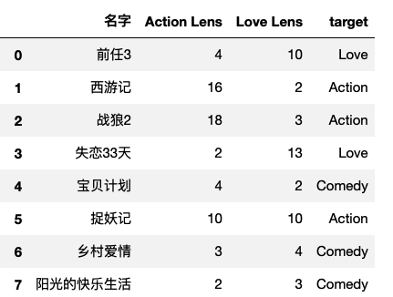

## 自我介绍

张晓波：bobo老师

- 工信部认聘的数据分析和人工智能专家组专家，参与数字化人才《岗位能力标准》的制订工作。

- 华为认证AI大模型专家讲师


​																		**专业的事交给专业的人去做**


### 有言在先

- 授课风格：
  - 没有鸡汤、没有段子。有认真负责的态度、有传道受业解惑的**育人之志**和**启智之能**。
- 学习方法
  - 课上动脑听、课下用心练、笔记常翻译、消化在心中
- 授课相关：``好的授课过程就好比是谈一场恋爱，从来都不是一个人的事``
  - 节奏快慢
  - 内容动态补充
  - 授课内容+顺序
  - ......
- Finally：
  - 人无完人，每个人都有不同的短板和不足之处。互相理解、互相适应、搞定AI、成就大计！

### 核心内容

- 参考企培方案

- 大致关键词：

  ```
  大模型接口调用、模型部署、模型微调、Agent智能体开发、RAG和graphRAG、MCP开发、Langchain开发框架（LangGraph）......
  ```

## 开发环境搭建

### Anaconda

**定义**：Anaconda是一个集成的Python发行版，专为数据科学、机器学习和AI开发而设计。它包含了常用的Python库、包管理工具（Conda）和Jupyter Notebook等开发工具。

**在机器学习和AI开发中使用的原因**

- **环境管理便捷**：可以通过Conda轻松创建和管理虚拟环境，为不同的项目设置独立的环境，避免Python依赖冲突。
- **内置丰富资源**：自带了众多常用的AI库，无需手动安装，节省了大量时间和精力。这使得开发者能够快速搭建起工作环境，立即开始项目开发。

### Jupyter Notebook

**定义**：Jupyter Notebook是一个基于Web的交互式开发环境，支持Python代码编写、调试、运行以及数据可视化。它被广泛应用于AI研究、数据分析和机器学习模型训练。

**在机器学习和AI开发中使用的原因**

- **交互式执行代码**：支持分块执行代码，便于调试和数据分析。在机器学习和AI开发中，经常需要对代码进行反复调试和修改，Jupyter Notebook的这种特性可以让开发者快速查看代码执行结果，及时调整代码逻辑。
- **文档与代码结合**：可以在Notebook中添加Markdown文档，方便记录研究过程、注释代码功能和撰写项目报告。对于机器学习和AI项目，这种文档与代码相结合的方式非常有利于知识的整理和分享。
- **与Anaconda完美兼容**：Anaconda内置Jupyter Notebook，开箱即用，两者结合可以为机器学习和AI开发提供一个高效、便捷的工作环境1。

**网盘下载安装：**

```
通过网盘分享的文件：Anaconda
链接: https://pan.baidu.com/s/1v2TkkKPMOu5j2sOQ9viuNQ?pwd=udkg 提取码: udkg 
--来自百度网盘超级会员v5的分享
```

**清华源下提供下载：**https://mirrors.tuna.tsinghua.edu.cn/anaconda/archive/

### Conda简介

Conda是一个开源的软件包管理系统和环境管理系统。它最初是为Python程序创建的，但现在已经可以打包和分发其他软件，适用于Linux、OS X和Windows系统。以下是关于conda的详细信息：

**主要功能**

- **包管理**：可以快速安装、运行和更新包及其依赖项，类似于Node.js的npm或Python的pip，但功能更强大，能更好地处理依赖关系。
- **环境管理**：能够轻松地在计算机上创建、保存、加载和切换环境，使得在同一台机器上管理多个软件包版本成为可能，这对于需要不同版本的Python或特定依赖项的项目非常有用。

**与pip的区别**

- **包管理范围**：conda不仅可以管理Python包，还可以管理其他语言的包；而pip主要用于管理Python包。
- **环境隔离方式**：conda本身可以创建和管理独立的环境，而pip一般要与虚拟环境（如venv）结合使用来实现类似的隔离效果。
- **依赖冲突解决**：conda能够解决包之间的依赖关系冲突，确保安装兼容的包；pip在安装包时如果存在依赖冲突，可能需要手动解决。

### 虚拟环境创建

**基本命令创建**

- **语法**：`conda create -n <环境名称> [选项]`。
- **示例**：创建一个名为`myenv`且指定Python版本为3.8的虚拟环境，命令为`conda create -n myenv python=3.10`2。

**指定路径创建**

- **使用`--prefix`参数**：例如`conda create --prefix /path/to/env python=3.8`，这会在`/path/to/env`目录下创建虚拟环境。

**激活与退出虚拟环境**

- **激活**：使用命令`conda activate <环境名称>`，激活后命令行提示符会显示当前环境名称，表示已切换到该环境。
- **退出**：使用命令`conda deactivate`可退出当前激活的虚拟环境。

**查看虚拟环境列表**：使用命令`conda env list`或`conda info -e`可以查看已有的虚拟环境列表。

**删除虚拟环境**：使用命令`conda remove -n <环境名称> --all`可根据环境名删除虚拟环境。

## 人工智能背景介绍

### 初始人工智能

- 概述：

  - 人工智能（Artificial Intelligence），英文缩写 AI。AI 第一次被提出来是在 1956 年，是由四位图灵奖得主、信息论创始人和一位诺贝尔得主在美国达特茅斯会议（DartmouthConference）上一同定义出来的。

  - 人工智能只是一个抽象概念，它不是任何具体的机器或算法。任何类似于人的智能或高于人的智能的机器或算法都可以称为人工智能。人工智能可以对人的意识、思维进行模拟，但又不是人的智能。有时候我们还会把人工智能分为弱人工智能（Weak AI）和强人工智能（Strong AI）
    - 弱人工智：
      - 弱人工智能是擅长于单个方面技能的人工智能。比如 AlphaGo 能战胜了众多世界围棋冠军的，在围棋领域所向披靡，但它只会下围棋，做不了其他事情。我们目前的人工智能相关的技术，比如图像识别，语言识别，自然语言处理等等，基本都是处于弱人工智能阶段。
    - 强人工智：
      - 强人工智能指的是在各方面都能和人类智能差不多的人工智能，人类能干的脑力劳动它都能干。创造强人工智能比创造弱人工智能难度要大很多，我们现阶段还做不到，只有在一些科幻电影中才能看到。

### 人工智能技术演变

人工智能早期阶段，迅速解决了一些对于人类来说比较困难，但是对于计算机来说相对容易的问题，比如下棋，推理，路径规划等等。但是也有早期人工智能解决不了的问题，比如图像识别、语音识别等。接下来，我们从如下3个维度展开讲解：

- 计算速度：

  - 我们下象棋的时候，通常需要思考很久才能推算出几步棋之后棋盘战局的变化，并且经常还会有看错看漏的情况。
  - 而计算机能在一瞬间计算出七八步棋甚至十几步棋之后棋盘的情况，并从中选出对自己最有利的下法来与对手对弈。面对如此强大的对手，人类早在 20 年前就已经输了。

- 算法：

  - 可能有人会想到人工智能在象棋领域早就战胜了人类最顶尖的选手，为什么在围棋领域一直到 2016 年才出了个 AlphaGo 把人类顶级棋手击败呢？
  - 比起象棋，围棋的局面发展的可能性要复杂得多。
  - 或许我们在设计象棋 AI 的时候可以使用暴力计算的方法，把几步之内所有可能的走法都遍历一次，然后选一个最优下法。同样的方法放到围棋上通了，围棋每一步的可能性都太多了，用暴力计算法设计出来的围棋AI，它的棋力是很差的。

  - 虽然 AlphaGo 的计算非常快，可以在短时间完成大量运算，但是AlphaGo 比其他棋类 AI 强的地方并不是计算能力，而是它的算法，也可以理解为它拥有更强大的“智慧”。
    - 就像是进行小学速算比赛，题目是 100 以内的加减法，10 个小学生为一队 1个数学系的博士为另一队。如果比赛内容是 1 分钟哪个队做的正确题目多，小学生队肯定是能够战胜数学博士的。如果是进行大学生数学建模比赛，那 10000 个小学生也赢不了 1 个数学博士。对于解决复杂的问题，需要的往往不只是计算速度，更多的应该是智慧。

- 识别规则：

  - 对于一些人类比较擅长的任务，比如图像识别，语音识别，自然语言处理等，计算机却完成得很差。以视觉为例，人类的视觉从眼睛采集信息开始，但起到主要作用的是大脑。人类的大脑就像是一台超级计算机，可以轻松处理非常复杂的图像问题。人类的视觉能力是通过几亿年地不断进化，不断演变最终才得到的。
  - 在人工智能的早期阶段，计算机的智能通常是基于人工制定的“规则”，我们可以通过详细的规则去定义下棋的套路，推理的方法，以及路径规划的方案。但是我们却很难用规则去详细描述图片中的物体，比如我们要判断一张图片中是否存在猫。那我们先要通过规则去定义一只猫，如图 1.1 所示。

  

  - 观察图 1.1 中的猫，我们可以知道猫有一个圆脑袋，两个三角形的耳朵，又胖又长的身体，和一条长尾巴，然后可以定义一套规则在图片中寻找猫。这看起来好像是可行的，但是如果我们遇到的是图 1.2，图 1.3 中的猫该怎么办？

  

  - 猫可能只露出身体的一部分，可能会摆出奇怪的造型，那么我们又要针对这些情况定义新的规则。
  - 从这个例子中大家应该能看得出来，即使是一只很普通的家养宠物，都可能会出现无数种不同的外形。如果我们使用人工定义的规则去定义这个物体，那么可能需要设置非常大量的规则，并且效果也不一定会很好。仅仅一个物体就这么复杂，而现实中常见的各种物体成千上万，所以在图像识别领域，使用使用人为定义的规则去做识别肯定是行不通的。很多其他的领域也同样存在这种问题。

  **由于人们没有办法设计出足够复杂的规则来精确描述世界，所以 AI 系统需要具备自我学习的能力，即从原始数据中获取有用的知识。这种能力被称为机器学习（Machine Learning）。**

### 机器学习

- 概念：

  - 机器学习就是从数据中自动分析获得规律，并利用规律对未知数据进行预测、分类或者决策的过程。

- 举个例子：

  - 假如我们现在都是原始人，并不知道太阳和月亮是什么东西。
  - 但是我们可以观察天上的太阳和月亮，并且把太阳出来时候的光线和温度记录下来，把月亮出来时候的光线和温度记录下来**（这就相当于是收集数据）**。
  - 观察了 100天之后，我们进行思考，总结这 100 天的规律我们可以发现，太阳和月亮是交替出现的。出太阳的时候光线比较亮，温度比较高。月亮出来的时候光线比较暗，温度比较低**（这相当于是分析数据，建立模型）**。
  - 之后我们看到太阳准备落山，月亮准备出来的时候我们就知道温度要降低可能要多穿树叶或毛皮**（预测未来的情况）**。
  - 因此，机器学习可以利用已有的数据进行学习，获得一个训练好的模型，然后可以利用此模型预测未来的情况。

- 机器学习和人类思维的对比：

  - 我们可以使用历史数据来训练一个机器学习的模型，模型训练好之后，再放入新的数据，模型就可以对新的数据进行预测分析。人类也善于从以往的经验中总结规律，当遇到新的问题时，我们可以根据之前的经验来预测未来的结果。

  

- 深入理解机器学习：

  - 算法模型对象：

    - 一种特殊的对象，特殊之处在于，该对象内部集成/封装了某种形式的算法/方程。该算法/方程用于找寻数据间的规律。假设某一个模型内部封装的算法/方程如下：
      - y = w * x + b，这是一个还没有求出解的方程式。

  - 样本数据：

    - 特征数据：自变量（一个样本的描述信息）
    - 标签数据：因变量（一个样本数据的结果）

    

  - 模型的训练：

    - 将样本数据带入到算法模型对象内部的算法/方程中，对算法/方程进行求解操作。
    - 在该算法/方程中 y = w * x + b，如果求出了w和b则方程就可有解。
    - 模型训练就是在使用算法/方程找寻样本数据之间的规律。 

  - 模型的作用：

    - 对未知样本实现预测、分类或者决策。
    - 算法/方程的解就是模型实现分类或者预测的结果。

  - 算法模型的分类：

    - 有监督类别：
      - 有监督学习是指使用带有标签的样本数据来训练模型
    - 无监督类别：
      - 无监督学习是指使用没有标签的样本的数据训练模型


## 机器学习基础操作

#### sklearn的数据集接口介绍

```
sklearn.datasets.load_*():获取小规模的数据集

sklearn.datasets.fetch_*():获取大规模的数据集
```

### 数据集切分

- 前提：
  - 机器学习就是从数据中自动分析获得规律，并利用规律对未知数据进行预测。换句话说，机器学习的算法模型一定是要经过样本数据对其进行训练，才可以对未知数据进行预测。
- 问题：
  - 当我们有了一组样本数据后，是否要是有所有的样本数据对模型进行训练呢？
- 思考：
  - 一个算法模型被训练好之后，我们如何获知该模型在具体应用中的性能和效果呢？
  - 好比一个学生，当进行了一个学期的系统学习后，如何获知该名学生学习后的综合效果呢？
- 数据集切分
  - 当有了一组完整的样本数据后，一定会将该样本数据一分为二，生成训练集数据和测试集数据。
    - 训练集数据：通常80%作为训练集数据，用于进行模型的训练，让模型在训练集数据中学习/找寻训练样本中的规律。
    - 测试集数据：剩下20%的数据作为测试集数据，用于测试和评估训练好模型的综合表现效果。
  - 如果模型的训练和测试全都用同一组数据，则通常来讲，模型评估的效果一般都会很好，就好比是用一名同学见过的/学过的题对其进行考试，则考试结果一般都会很好，模型的评估也是一样的道理。
- 数据集切分API：

```python
from sklearn.model_selection import train_test_split
train_test_split(x,y,test_size,random_state)

参数介绍：
  x：特征
  y：目标
  test_size：测试集的比例
  random_state：打乱的随机种子
返回值：
	训练特征，测试特征，训练标签，测试标签
```

## KNN算法模型

### KNN简介  

KNN（k-Nearest Neighbor）也叫做K近邻算法，个人认为该模型是机器学习中算法原理最简单的一种分类模型。KNN常用于样本量较小或特征空间/维度较小的分类问题中。

什么是分类问题？

```
所谓的分类，就是将一个未知类别的样本归属的一个已知的类别中。机器学习中，分类问题的目标/标签数据是离散型的类别数据，表示一些具体的类别。下面是一些常见的分类问题：

1.邮件分类：根据邮件的内容作为样本特征，将其分类为垃圾邮件或非垃圾邮件。其中的垃圾邮件类型和非垃圾邮件类型就是分类问题中的离散型类别的标签/目标数据。

2.信用评估：根据个人的收入、信用历史、负债情况等特征，将申请人的信用风险进行分类，例如将申请人分为高风险或低风险。

3.疾病诊断：根据患者的症状、体征和检查结果，将患者的疾病进行分类，例如将患者的病情分为正常或患有某种疾病。

4.图像分类：根据图像的特征和内容，将图像分类为不同的物体、场景或模式。例如，将图像中的动物分类为猫、狗、鸟类等不同类别。

```

### KNN分类算法原理

简单地说，KNN算法是采用测量不同特征值之间的距离方法进行分类。大家可以类别：近朱者赤近墨者黑这句话进行理解。

下面，我们就详细来理解下KNN的分类原理，先看下图：w1（猫）、w2（狗）和w3（兔子）是三个已知类群，X则是一个未知类别的图片样本，现在要基于KNN算法将X样本分到w1、w2和w3其中的一个类别中，以确定X图片中的动物到底是猫、狗还是兔子。


根据我们的直接感受，应该是衡量X样本距离w1、w2和w3哪个类群最近，则X样本就应该被分到哪个类别中。这个是不是就好比与：近朱者赤近墨者黑呢。那么，KNN究竟是如何实现的分类呢？

**实现步骤：**

1. 算距离：KNN算法会计算X样本到其余所有样本之间的距离。（有几个其余样本就会计算几次距离）
2. 找近邻：定义一个k值，找出离X最近的k个样本最为X最近的k个邻居。注意，k值是需要认为定义的一个数值。
3. 投票：根据k个最近的邻居样本的类别标签进行投票，哪个类别的标签得票最多（在k个样本中哪个类别样本数量最多），则X样本就归属到该类别中。

**注意：不同的k，可能会造成不同的分类结果**

在下图中，如果k为3则小球的分类结果为三角形，k为5则分类结果为正方形。因此，k值的最优选择在KNN中是比较重要的一个环节，稍后会详细进行讲解说明。


**距离计算方式：**

可以是欧式距离、曼卡顿距离或者闵可夫斯基距离等方式。


#### 电影分类

众所周知，电影可以按照题材分类，然而题材本身是如何定义的?由谁来判定某部电影属于哪个题材?也就是说同一题材的电影具有哪些公共特征?这些都是在进行电影分类时必须要考虑的问题。下面我们就一起来探究下电影如何实现分类？

| 电影名称                 | 打斗镜头 | 接吻镜头 | 电影类型 |
| ------------------------ | -------- | -------- | -------- |
| California Man           | 3        | 104      | 爱情片   |
| He Not Really into Dudes | 2        | 100      | 爱情片   |
| Beautiful Woman          | 1        | 81       | 爱情片   |
| Kevin Longblade          | 101      | 10       | 动作片   |
| Robo Slayer 3000         | 99       | 5        | 动作片   |
| Amped 2                  | 98       | 2        | 动作片   |
| ？                       | 18       | 90       | 未知     |

```
采集到了一组电影的样本数据，每一个电影样本有两个特征维度：打斗镜头和接吻镜头，电影类型为目标数据，有爱情和动作两种类别。其中有一部未知类别的电影"?",并且提取到了该电影的打斗和接吻镜头的数量。接下来，使用KNN来计算电影 “?” 的特征到其他已知类型电影特征之间的距离。
```

下面可以，观测下具体的距离显示：


根据欧式距离，进行距离计算结果如下：

| 电影名称                 | 与未知类型电影“?”的距离 |
| ------------------------ | ----------------------- |
| California Man           | 20.5                    |
| He Not Really into Dudes | 18.7                    |
| Beautiful Woman          | 19.2                    |
| Kevin Longblade          | 115.3                   |
| Robo Slayer 3000         | 117.4                   |
| Amped 2                  | 118.9                   |

制定k的值，找到电影 “  ？”周围最近的k个邻居，假定k的值为3，则离其最近的3个邻居是：

| 电影名称                 | 电影类型 |
| ------------------------ | -------- |
| California Man           | 爱情片   |
| He Not Really into Dudes | 爱情片   |
| Beautiful Woman          | 爱情片   |

投票：最近的3个邻居种，爱情类别的得票最多，因此 “ ？”电影的类别被KNN划分到了爱情片类别。

#### 模型超参数

- n_neighbors（K值）：表示KNN算法选择的最近邻样本的数量。

- weights（权重）：用于指定最近邻样本的投票权重。常见的选择有"uniform"（所有样本的权重相等）和"distance"（给更近的邻居更高的权重）。"distance"考虑了距离更近的邻居对分类的重要性，可以在样本数量较少或数据类别分布不平衡的情况下提高模型性能。

- metric（距离度量）：用于计算样本之间的距离。常见的选择有"euclidean"（欧氏距离）、"manhattan"（曼哈顿距离）和"minkowski"（闵可夫斯基距离）等。

  - 欧氏距离：欧氏距离是最常用的距离度量方式。在欧几里得空间中，欧氏距离是计算两点之间的直线距离。当数据的特征具有连续性且各特征之间的量纲相同时，可以使用欧氏距离作为距离度量方式。
  - 曼哈顿距离：曼哈顿距离衡量的是两个点之间在各个坐标轴上的绝对距离总和。当特征具有明显不同的量纲，或者数据具有离散性特征时，可以使用曼哈顿距离作为距离度量方式。
  - 闵可夫斯基距离：闵可夫斯基距离是欧氏距离和曼哈顿距离的一般化。它通过参数p控制距离的倾向性。当p等于1时，就是曼哈顿距离；当p等于2时，就是欧氏距离。因此，闵可夫斯基距离可以用来平衡欧氏距离和曼哈顿距离的效果。

  ```
  一般来说，欧氏距离适用于连续性且量纲相同的数据，曼哈顿距离适用于具有离散性特征或有不同量纲的数据，闵可夫斯基距离可以根据具体情况灵活选择参数p来平衡距离衡量的效果。
  ```

### KNN模型应用

#### 电影分类

- 部分样本数据展示



- 代码实操

```python
import pandas as pd
from sklearn.model_selection import train_test_split
from sklearn.neighbors import KNeighborsClassifier
import warnings
warnings.filterwarnings("ignore")

#1.提取样本数据
data = pd.read_excel('./datasets/my_films.xlsx') 
feature = data[['Action Lens','Love Lens']]#特征
target = data['target']#标签

#2.数据集划分
x_train,x_test,y_train,y_test = train_test_split(feature,target,test_size=0.2,random_state=2023)

#3.建模:在创建模型的时候就需要人为指定k的值
model = KNeighborsClassifier(n_neighbors=5)

#4.训练模型
model.fit(x_train,y_train)#参数：X表示二维形状的特征，y表示标签

#5.对模型进行评估
model.score(x_test,y_test)

#6.使用训练好的模型进行分类任务
movie = [10,90]
model.predict([movie])
```

## 线性回归模型

### 何为回归？

- 回归问题判定：
  - 回归问题对应的样本数据的标签数据是连续性的值，而分类问题对应的是离散型的值。
  - 在社会中产生的数据必然是离散型或者是连续型的数据，那么企业针对数据所产生的需求也无非是分类问题或者回归问题。
- 常见的回归问题：
  - 预测房价
  - 销售额的预测
  - 贷款额度指定
  - ......

**线性回归在生活中的映射**

- 学生期末成绩制定
  - 总成绩 = 0.7 * 考试成绩 + 0.3 * 平时成绩
  - 则该例子中，特征值为考试成绩和平时成绩，目标值为总成绩。从此案例中大概可以感受到
    - 回归算法预测出来的结果其实就是经过相关的算法计算出来的结果值！
    - 每一个特征需要有一个权重的占比，这个权重的占比明确后，则就可以得到最终的计算结果，也就是获取了最终预测的结果了。
      - 那么这个特征对应的权重如何获取或者如何制定呢？

现在有一组售房数据：

| 面积 | 售价 |
| ---- | ---- |
| 55   | 110  |
| 76   | 152  |
| 80   | 160  |
| 100  | 200  |
| 120  | 240  |
| 150  | 300  |

对售房数据的分布情况进行展示


问题：假如现在有一套房子，面积为76.8平米，那么这套房子应该卖多少钱呢？也就是如何预测该套房子的价钱呢？上图中散点的分布情况就是面积和价钱这两个值之间的关系，那么如果该关系可以用一种分布趋势来表示的话，那么是不是就可以通过这分布趋势预测出新房子的价格呢？


在上图中使用了一条直线来表示了房子的价格和面积对应的分布趋势，那么该趋势找到后，就可以基于该趋势根据新房子的面积预测出新房子的价格。

**线性回归的作用：找出特征和目标之间存在的某种趋势，在二维平面中，该种趋势可以用一条线段来表示，该条线段用一元一次线性方程来表示：y = w * x + b。**

```
将上述的售房数据，带入到线性方程中，经过求解，w和b变为了已知，现在方程为：y = 2 * x + 0。则发现，在上述售房数据中，面积和价格之间的关系是二倍的关系，其实就可以映射成：价格 = 2 * 面积 ，这个方程就是价格和面积的分布趋势，也就是说根据该方程就可以进行新房子价格的预测。
```

### 多元回归

思考：上述的线性方程y=wx+b其中x为特征y为目标，这种方程作为线性关系模型的预测依据的话是否可以满足所有的预测场景呢？

比如，现在房价受影响的因素不光是面积了，加入了采光率和楼层了，那么就意味着特征变成了3种。在原始的一元线性方程y=wx+b中只可以有一个特征，则该方程不具备通用性。可以使用多元方程！

```
多元方程为：y = w1 * x1 + w2 * x2 + wn * xn 存在多个自变量特征x
则房价预测可为：售价 = （w1 * 面积 + w2 * 采光率 + w3 * 楼层）+ b，考虑到多种特征因素对房价的影响。
```


### 损失函数

如果在房价预测案例中，房子的面积和价格的分布规律如下图所示（非线性的分布），那是否还可以使用一条直线表示特征和目标之间的趋势呢？


可以，只要保证直线距离所有的散点距离最近，则该直线还是可以在一定程度上表示非线性分布散点之间的分布规律。但是该规律进行的预测会存在一定的**误差/损失**！


在多数的预测场景中，预测结果和真实结果之间都会存在一定的误差，那么误差存在，我们应该如何处理损失/误差呢？

**量化损失/损失函数**：真实结果y和预测结果(xw)差异平方的累加和（误差平方和/残差平方和）：


提问：损失函数公式中，误差的大小和哪个系数有直系的关联呢？

答案：和权重系数w是有直系关联。也就是说w的不同会导致误差大小的不同，那么线性回归算法迭代训练过程中最终的问题就转化成了**如何去求解线性方程中的w使得误差可以最小**。

### 如何求解最小损失

#### 最小二乘法

首先我们认为损失函数是一种凹函数（损失变化和w之间的关系），损失函数对权重系数进行求导，让其一阶导数为0 即可。导数等于0说明函数在这一点的切线斜率为0，既切线平行于x轴，而且函数在这有极值。


求解一阶导数：


导数为0：


```
核心三点：
	- 最小二乘法的作用：求解最小损失对应的参数向量w
	- 最小二乘法的原理：它认为模型的损失和w是满足一个凹函数。然后使用损失函数对w求导，让其一阶导数为0即可找到最小损失。
	- 最小二乘法返回结果解读：最小损失对应的w，生成w的公式中出现了y标签数据，因此标签参与了模型训练。
```

### 模型详情

正轨方程（最小二乘法）：from sklearn.linear_model import LinearRegression

#### 正规方程

**波士顿房屋预测**

```python
from sklearn.model_selection import train_test_split
from sklearn.datasets import load_boston
from sklearn.linear_model import LinearRegression
import warnings
warnings.filterwarnings('ignore')

data = load_boston()
feature = data.data
target = data.target

x_train,x_test,y_train,y_test = train_test_split(feature,target,test_size=0.2,random_state=2020)

linner = LinearRegression()
linner.fit(x_train,y_train)

linner.coef_ #每一个特征维度的权重系数w
linner.intercept_ #返回截距

#将系数和特征名称结合在一起查看
[*zip(data.feature_names,linner.coef_)]

linner.score(x_test,y_test)
```

