### 人工智能、机器学习，神经网络以及深度学习之间的关系

**人工智能（Artificial Intelligence，简称AI）**

人工智能其实是一种抽象的概念，它并不是指任何实际的算法。人工智能是指可以对人的意识、思维进行模拟，但又不是人的智能。

**机器学习（Machine Learning，简称ML）**

机器学习是一门多领域交叉学科，涉及概率论、统计学等多门学科。机器学习包含很多具体的算法。既然人工智能是飘在天上的概念，那我们就需要一些具体的算法使得人工智能可以落地应用，而一般来说，这些具体的智能算法可以统称为机器学习算法。

**神经网络（Artificial Neural Networks，简称ANN）**

神经网络是众多机器学习算法中的其中一个，是模仿人类大脑神经结构构建出来的一种算法，构建出来的网络称为人工神经网络。

**深度学习（Deep Learning）**

深度学习则是一种特殊形式的神经网络模型，可以简单理解成是神经网络的升级、进阶版本。


### 神经网络

**人工神经网络**（英语：Artificial Neural Network，**ANN**），简称 **神经网络**（Neural Network，NN）或 **类神经网络**，是一种模仿生物神经网络的结构和功能的**计算模型**。

人脑可以看做是一个生物神经网络，由众多的神经元连接而成。每个神经元与其他神经元相连（神经元主要由三部分构成：细胞体、轴突和树突。）。各个神经元传递复杂的电信号，树突接收到输入信号，然后细胞核对信号进行处理，通过轴突输出信号。

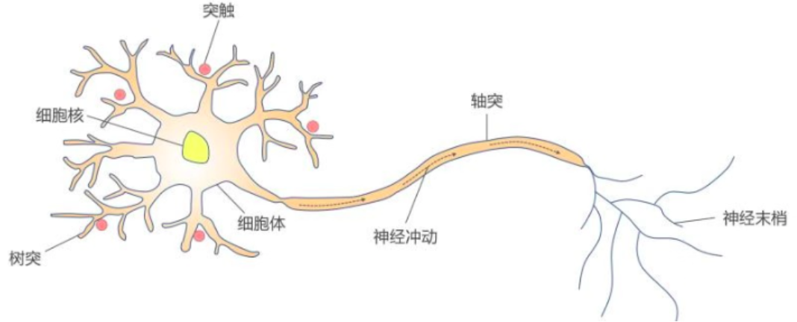

```
- 树突分支比较多，每个分支还可以再分支，长度一般比较短，作用是接受信号。
- 细胞体负责将树突结束到的信号，进行相关处理。
- 轴突只有一个，从细胞体的一个凸出部分伸出，长度一般比较长，作用是把细胞体处理后的信号传出到其他神经元。
- 轴突的末端分为许多小支,也就是神经末梢，其负责将该神经元连接到其他神经元的树突上。
- 大脑可视作为 1000 多亿神经元组成的神经网络。
```

**在计算机中我们如何构建人工神经网络中的神经元呢？**

### 人工“神经元”

1943 年，心理学家 Warren McCulloch（沃伦·麦卡洛克） 和逻辑学家 Walter Pitts（沃尔特·皮茨） 将生物神经网络的神经元抽象为一个简易数学模型，也就是一直沿用至今的 **M-P 神经元模型**。

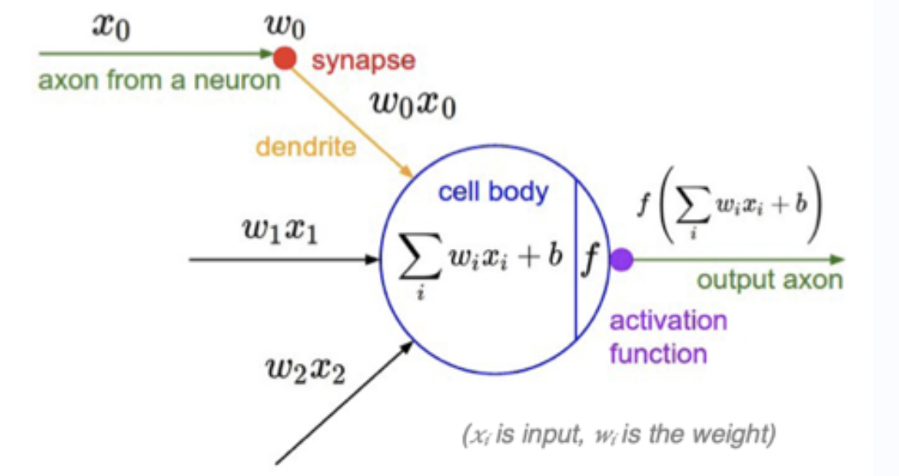

受生物神经元的启发，人工神经元接收来自其他神经元或外部源的输入（x<sub>i</sub>），每个输入都有一个相关的权值（w<sub>i</sub>），它是根据该输入对当前神经元的重要性来确定的，**对该输入信号加权求和后（汇总信号），经过一个激活函数 f处理后，计算得到该神经元的输出**。

>说明：
>
>+ x<sub>0</sub>,x<sub>1</sub>,x<sub>2</sub>,....x<sub>i</sub>为各项输入数据
>
>+ w<sub>0</sub>,w<sub>1</sub>,w<sub>2</sub>,...w<sub>i</sub>为各项输入数据的权重值。w可以调节输入信号的值的大小，让输入信号变大(w>0)，为零(w=0)或者减小(w<0)。
>
>+ b 为偏置（bias）
>
>+ f为**激活函数**，常见的激活函数有Sigmoid、tanh、**ReLU**、ReLU、**Softmax**等等
>
>激活函数用于将非线性因素引入神经网络，使其能够学习更复杂的函数。如果没有激活函数，神经网络只能学习其输入数据的线性组合函数。
>
>简单来讲，激活函数的作用就像是给这个神经元加上了一个“魔法开关”，让它能够根据输入的不同做出不同的反应。

#### 神经元简单应用

##### 示例

假如有一个人工神经元，它有 3 个输入𝑥1，𝑥2，𝑥3，同时已知 b=-0.6，𝑤1=𝑤2=𝑤3=0.5，激活函数假设为sign(x)，该函数的特点是当 x>0 时，输出值为 1;当 x= 0 时，输出值为 0,;当 x<0 时，输出值为-1。我们根据神经元计算公式y = 𝑓(∑( (𝑤i𝑥i) + 𝑏 ) = sign( ∑((𝑤i𝑥i) + 𝑏 ) 就可以得到如下计算结果：

| x1   | x2   | x3   | y    |
| ---- | ---- | ---- | ---- |
| 0    | 0    | 0    | -1   |
| 0    | 1    | 1    | 1    |
| 1    | 0    | 0    | -1   |
| 1    | 1    | 1    | 1    |

##### 思考

我们知道神经元输出的结果就是y，那么计算y我们得求解出w，那么w是如何被求解出来的呢？需要用到学习规则。在学习规则计算中，我们是可以先随机生成各个特征维度对应的w，然后根据学习规则对w进行迭代调整。

##### 学习规则

假设有如下一个学习规则，此处我们不解释这个学习规则是怎么推导出来的。在这里我们可以先接受下面的学习规则公式即可：

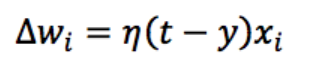

```
△Wi表示第i个权值的变化；
η(eta)表示学习率，用来调节权值变化的大小；
t是正确的标签；
y是神经元返回结果。
```

##### 综合实现

假设现在有一个神经元，已知有三个输入 x0=1，x1=0，x2=-1，权值随机初始值为 w0=-5，w1=0，w2=0，学习率𝜂=1，正确的标签 t=1。(注意在这个例子中偏置值 b 用 𝑤0 × 𝑥0来表示，x0 的值固定为 1)

- Step1:我们首先计算神经元对这三个输入信号的输出

  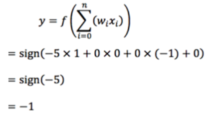

  由于正确标签为1，但是神经元计算出结果为-1，所以需要对神经元中的权值进行调整：

  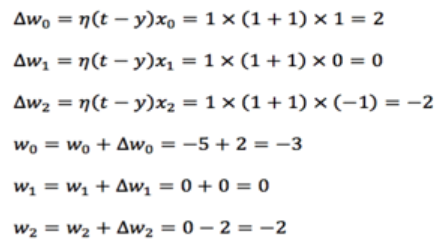

  

- Step2：重新计算神经元输出，如果依然出现和正确标签不一致的情况发生，则继续迭代也就是再次根据学习规则调整各个权值，然后再次计算神经元输出结果，直到和正确标签一致，则迭代停止。

- 代码实现：

  ```python
  import numpy as np
  # 定义输入
  x0 = 1
  x1 = 0
  x2 = -1
  # 随机定义权值
  w0 = -5
  w1 = 0
  w2 = 0
  # 定义正确的标签
  t=1
  # 定义学习率lr(learning rate) 
  lr = 1
  # 循环一个比较大的次数，比如100 （迭代次数）
  for i in range(100):
      # 打印权值
      print(w0,w1,w2)
      # 计算感知器的输出
      y = np.sign(w0 * x0 + w1 * x1 + w2*x2) 
      # 如果感知器输出不等于正确的标签
      if(y != t):
          # 更新权值
          w0 = w0 + lr * (t-y) * x0 
          w1 = w1 + lr * (t-y) * x1
          w2 = w2 + lr * (t-y) * x2
      # 如果感知器输出等于正确的标签 
      else:# 训练结束 
          print('done') # 退出循环
          break
  ```

### 人工神经网络ANN   

有了对单个神经元的理解和应用后，我们就可以利用神经元来构建神经网络了，如下图所示：

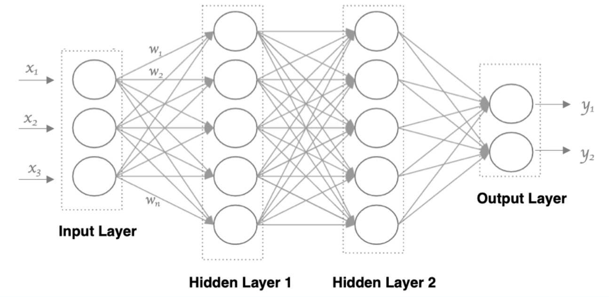

神经网络的结构可以有多层，多层的神经网络可以由“输入层”， “隐藏层”以及“输出层”组成。其中隐藏层（输入和输出层中间的都是隐层）可能有 0 到多个，所以最简单的神经网络就只有输入层和输出层。神经网络的每一层都由若干个“神经元”节点组成。

**注意：**

```
1. 神经网络中信息只向一个方向移动，即从输入层的神经元节点向前移动，通过隐藏层神经元节点，再向输出层的神经元节点移动
2. 同一层的神经元之间没有连接。
3. 每一层神经元的输出就是下一层神经元的输入。
4. 每个连接都有一个权值。
```

思考：神经网络为何会设计成多层结构呢？

1. **特征学习与提取**：每一层神经元都可以从上一层的输出中学习并提取更有用的特征。
2. **提高泛化能力**：当网络有足够的层数和节点时，会使得多层神经网络具有较好的泛化能力。这就像是你学会了骑自行车后，即使换了一辆不同的自行车，你也能很快适应并骑好它。因为你已经掌握了骑自行车的基本技能和原理。
3. **层次化的信息处理**：多层结构提供了层次化的信息处理机制，每层负责不同的抽象级别。这种层次化有助于理解和解决问题。比如在图像识别任务中，第一层可能会识别出图像中的线条和边缘，第二层可能会识别出形状和纹理，而更高层则可能识别出整个物体或场景。

综上所述，神经网络设计多层的作用和意义在于可以使其能够更好地处理复杂问题并适应新环境。

## Pytorch介绍与安装

### 1.GPU简介

#### 1.1 背景

众所周知，深度学习作为一种能够从海量数据中自主学习和提炼知识的一种技术，并且正在为各行各业赋能。深度学习这一技术不仅赋予了计算机前所未有的智能能力，更为创新注入了强劲的动力，使得看似无法落地的业务场景充满了无限可能。

凭借其卓越的数据处理能力，深度学习使得计算机能够实现多种过去仅为人类所独有的认知智能。通常而言，深度神经网络的训练过程极其复杂，通常需要进行大量的并行计算。传统的计算设备难以满足这一需求，而 GPU则可以凭借其大规模并行计算架构，完美地提供了所需的计算能力。通过 GPU 的加持，深度学习模型得以高效训练，从而使得这些复杂的智能任务得以实现。因此，GPU 不仅是深度学习技术的核心算力引擎，更是推动人工智能不断向前发展的关键力量。


#### 1.2 何为GPU

GPU是**图形处理单元**，它是专门设计用来加速图像和视频渲染的处理器。随着计算机图形技术的发展，实时 3D 图形的渲染需求逐渐增多，传统的CPU（中央处理器）难以高效处理这些繁重的计算任务。GPU 的出现大大缓解了这一负担，通过其独特的架构将大量的图形处理操作从 CPU 中剥离出来，从而极大地提升了系统的图形处理能力。

GPU 的架构设计非常独特，由成百上千个小型处理单元组成，每个处理单元能够独立并行执行指令。这种高度并行的处理能力使 GPU 能够同时处理海量数据，这也是其与多核 CPU 的相似之处。CPU 虽然也有多核设计，但每个核心的任务通常是串行执行的。而 GPU 的每个小型处理单元则可以相互并行执行不同的指令集，使得 GPU 能够在短时间内处理大量计算任务。

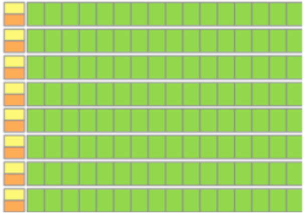

#### 1.3 GPU&深度学习

在深度学习领域，GPU的作用主要体现在以下几个方面：

1. **并行计算能力**：GPU拥有大量的处理单元，它们能够同时处理数千个线程，这使得它在执行大规模矩阵运算和向量计算时具有显著优势。
2. **高内存带宽**：GPU使用高速显存，提供比CPU内存更高的带宽，这对于深度学习中频繁的数据读写操作至关重要。
3. **优化的架构**：GPU的架构专为数据并行和任务并行设计，适合执行大量相同类型的简单计算任务，如深度学习中的矩阵乘法和卷积运算。

总的来说，GPU通过其高度并行的处理能力和优化的内存访问速度，极大地加速了深度学习模型的训练过程，提高了模型的准确性和泛化能力。

#### 1.4 CUDA简介

CUDA是**一个由NVIDIA推出的通用并行计算平台和编程模型**。它主要用于利用NVIDIA GPU（图形处理器）进行大规模并行计算，使得开发者能够更加高效地利用GPU的强大计算能力来处理各种复杂的计算任务。

``NVIDIA；翻译为“英伟达”，一家以设计显示芯片和主板芯片组为主的半导体公司``

**CUDA与GPU的关系**

- **硬件基础：**GPU是CUDA运行的硬件基础。没有GPU，CUDA就无法发挥其并行计算的优势。
- **软件平台：**CUDA是NVIDIA为GPU计算提供的软件平台和编程模型。它允许开发者使用C、C++和Python等编程语言编写在支持CUDA的处理器上运行的并行程序。
- **并行计算：**CUDA的核心是其并行计算能力。通过将计算任务分解成多个小任务，并分配给GPU上的多个核心同时执行，CUDA能够显著提高计算效率。
- **优化性能：**CUDA还提供了一系列的优化工具和库，帮助开发者更好地利用GPU资源，提高程序的性能。

总的来说，CUDA和GPU之间的关系紧密而复杂。CUDA作为编程模型和软件平台，为开发者提供了利用GPU进行高性能计算的能力；而GPU则作为硬件基础，为CUDA提供了强大的计算能力和并行处理能力。两者相辅相成，共同推动了并行计算的发展和应用。

**CUDA和GPU的关系可以通过一个通俗的比喻来说明：**

1. **GPU**：想象GPU是一个巨大的超级市场，它拥有成千上万个收银台（核心），每个收银台都可以同时处理一笔交易（计算任务）。但是，如果没有组织和协调，这些收银台可能会混乱不堪，效率低下。
2. **CUDA**：CUDA就像是这个超级市场的经理，它负责制定规则、分配任务、确保所有收银台高效运作。没有CUDA，GPU就像是一个没有组织的市场，虽然有很多资源，但无法有效利用。
3. **关联**：CUDA是NVIDIA开发的并行计算平台和编程模型，它允许开发者编写能够在GPU上运行的并行程序。GPU提供了并行计算的硬件基础，而CUDA提供了软件层面的支持，使得开发者能够充分利用GPU的强大计算能力。

总结来说，GPU是硬件，提供了并行计算的能力；而CUDA是软件，提供了一种编程模型，让开发者能够高效地利用GPU进行并行计算。两者结合，就像是一个有组织的超级市场，能够高效地处理大量的计算任务。

### 2.Pytorch框架介绍

#### 2.1 Pytorch框架简介

在深度学习初始阶段，每个深度学习研究者都需要写大量的重复代码，为了提高工作效率，这些研究者就将这些代码写成了一个框架放到网上让所有研究者一起使用，接着网上就出现了不同的框架。

PyTorch是一个开源的深度学习框架，由Facebook人工智能研究院（FAIR）开发。它提供了一套动态张量计算库，具有易于使用、高效性能和强大的扩展性等特点。PyTorch支持在GPU上运行，能够大大加速深度学习模型的训练和推理过程。

在深度学习和人工智能领域，PyTorch已成为最受欢迎的开源框架之一。随着技术的不断进步，PyTorch也在持续更新和优化。

#### 2.2 其他框架介绍

随着时间的推移，最为好用的几个框架被大量的人使用从而流行了起来，首先让我们来介绍一下目前全世界最为流行的几大深度学习框架。

1. **TensorFlow**
   - **灵活性与可扩展性**：TensorFlow由Google开发，支持分布式训练，能够在不同硬件上高效运行，拥有庞大的社区和丰富的资源。
   - **适用场景**：适用于各种应用场景，如自然语言处理、图像识别和语音合成等。
2. **PyTorch**
   - **易用性与灵活性**：PyTorch由Facebook开发，强调易用性和灵活性，提供动态计算图，便于模型构建和调试。
   - **适用场景**：在科研领域非常受欢迎，适用于快速原型设计和实验。
3. **Keras**
   - **高层次API**：Keras是一个高层次的深度学习框架，专注于易用性和可扩展性，支持多种后端。
   - **适用场景**：适用于快速原型设计和生产级应用开发。
4. **Caffe2**
   - **高性能与灵活性**：Caffe2由Facebook开源，适用于构建和部署大规模的机器学习模型。
   - **适用场景**：实时分析、预测和推荐等应用。
5. **MXNet**
   - **多语言支持**：MXNet是一个高性能、可扩展的深度学习框架，支持多种语言和平台。
   - **适用场景**：自然语言处理、计算机视觉和语音识别等。
6. **Theano**
   - **性能与稳定性**：Theano是一个Python编写的深度学习框架，强调性能和稳定性。
   - **适用场景**：研究和原型设计，尤其是在数学和理论深度学习方面。
7. **CNTK**
   - **微软开发**：CNTK是微软开发的深度学习框架，具有高性能、灵活性和易用性。
   - **适用场景**：自然语言处理、图像识别和语音合成等。

总的来说，在选择深度学习框架时，需要考虑项目的具体需求、团队的技能水平、硬件资源等因素。例如，对于需要快速迭代和实验的项目，PyTorch可能是一个更好的选择；而对于需要大规模部署和生产的项目，TensorFlow可能更适合。同时，也要考虑框架的社区活跃度和长期维护情况，以确保项目的可持续发展。

### 3.Pytorch安装

#### 3.1 安装准备

在开始安装PyTorch之前，我们需要进行一些准备工作。首先，确保您的计算机上已安装了合适版本的Python。PyTorch需要Python 3.6或更高版本。同时，您还需要安装pip包管理器，用于安装PyTorch和其他依赖项。所以我们可以通过安装Anaconda来创建一个适合深度学习的Python环境。

Anaconda安装：访问Anaconda官网（[Free Download | Anaconda](https://www.anaconda.com/download)），选择适合你操作系统的版本，并下载安装包

#### 3.2 NVIDIA显卡

在安装PyTorch之前，我们需要判断您的计算机**是否安装了NVIDIA显卡，**因为PyTorch的GPU版本需要NVIDIA显卡来加速计算。您可以通过以下步骤来判断：

```
1.设备管理器：在Windows上，按下Win键和X键，然后选择“设备管理器”。在macOS上，打开“系统偏好设置”，选择“硬件”选项卡，然后点击“设备管理器”。

2.显示适配器：在设备管理器中，展开“显示适配器”或“图形处理器”部分，查看是否有NVIDIA显卡的列表。如果有NVIDIA显卡，那么您的计算机适合安装PyTorch的GPU版本。
```

如果没有NVIDIA显卡，您可以**只安装PyTorch的CPU版本。**如果您有NVIDIA显卡，您还需要进行其他步骤来**安装PyTorch的GPU版本。**

Windows系统，无NVIDIA显卡示例图：

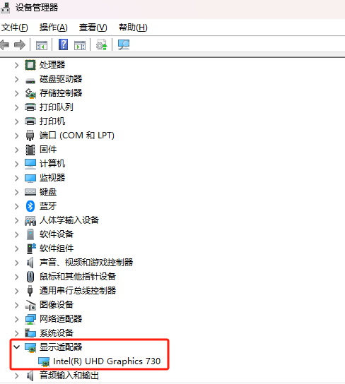

Windows系统，有NVIDIA显卡示例图：

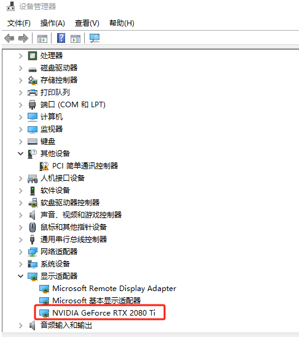

#### 3.3 安装CPU版本Pytorch

在安装PyTorch之前，**为了管理不同项目的Python环境，**通常建议创建一个虚拟环境。虚拟环境可以帮助您**隔离不同项目的依赖项，**避免不同项目之间的冲突。以下是创建虚拟环境的步骤：

**创建虚拟环境：**运行以下命令来创建一个新的虚拟环境。您可以将<env_name>替换为您喜欢的环境名称，例如“myenv”

```python
conda create -n <env_name> python=<version>
```

例如，要创建一个名为`myenv`的虚拟环境，其中Python版本为3.9，可以运行：

```python
conda create -n myenv python=3.9
```

**激活虚拟环境：**运行以下命令来激活刚刚创建的虚拟环境。在Windows上，使用`activate`命令；在macOS和Linux上，使用`source`命令：

```python
conda activate myenv
```

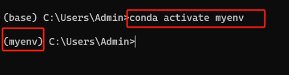

**安装PyTorch（CPU）：**在激活的虚拟环境中，使用pip安装PyTorch。根据您的需求，选择安装CPU版本。例如：**（网络不佳和必要的时候可以添加国内源）**

```python
pip install torch torchvision torchaudio
```

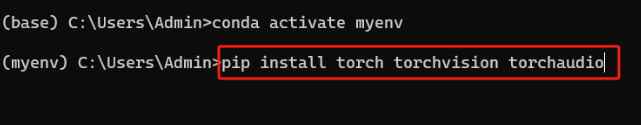

使用pip list查看是否安装成功：

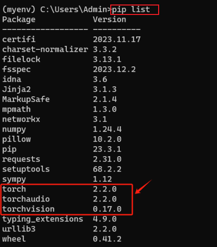

**至此，CPU版本的Pytorch就安装成功了！**

#### 3.4 安装GPU版本Pytorch

##### 3.4.1 查看CUDA显卡的驱动版本

> **在cmd命令行终端输入nvidia-smi，可以查看到版本为12.2。**

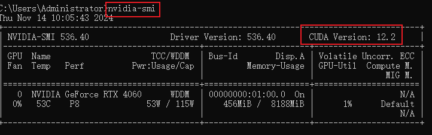

##### 3.4.2 安装CUDA

从官网下载对应的CUDA版本，由于我的显卡版本为12.2，我只需要安装小于或者等于12.2都是可以的，因此这里我安装12.2。

官网地址：[CUDA Toolkit Archive | NVIDIA Developer](https://developer.nvidia.com/cuda-toolkit-archive)

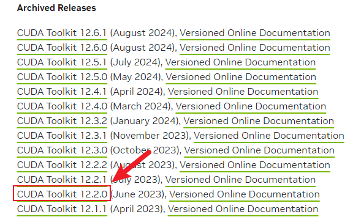

下一步：


**下载好后，双击安装包进行安装，可以安装在自定义的目录文件夹下**

选择“精简”模式，接下来一直点“下一步”就行了：

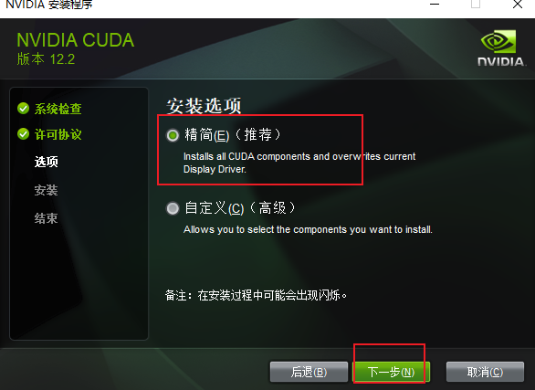

查看是否安装成功，在命令行输入以下指令进行检查，出现以下类似的输出就证明安装成功。

```
nvcc  -V
```

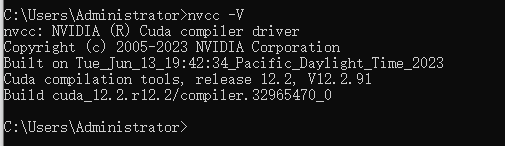

##### 3.4.4 安装Pytorch-GPU

在安装PyTorch之前，**为了管理不同项目的Python环境，**通常建议创建一个虚拟环境。虚拟环境可以帮助您**隔离不同项目的依赖项，**避免不同项目之间的冲突。以下是创建虚拟环境的步骤：

**创建虚拟环境：**运行以下命令来创建一个新的虚拟环境。您可以将<env_name>替换为您喜欢的环境名称，例如“myenv”

```python
conda create -n <env_name> python=<version>
```

例如，要创建一个名为`myenv`的虚拟环境，其中Python版本为3.9，可以运行：

```python
conda create -n myenv python=3.9
```

**激活虚拟环境：**运行以下命令来激活刚刚创建的虚拟环境。在Windows上，使用`activate`命令；在macOS和Linux上，使用`source`命令：

```python
conda activate myenv
```


在激活的虚拟环境中，使用pip安装PyTorch。根据您的需求，选择安装GPU版本。例如：**（网络不佳和必要的时候可以添加国内源）**

**官网链接：**[PyTorch](https://pytorch.org/)

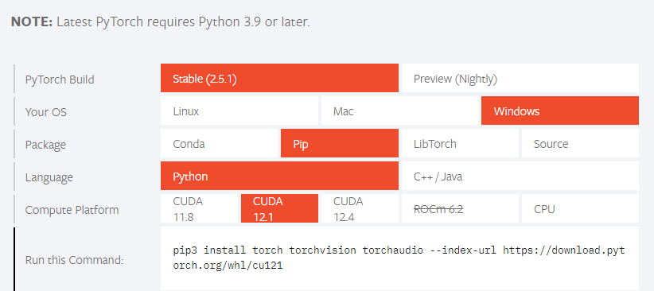

```python
pip3 install torch torchvision torchaudio --index-url https://download.pytorch.org/whl/cu121
```

**注意：该安装会比较慢(1-2小时)，请耐心等待!**

3.4.5 验证安装

```python
import torch
 
print(torch.__version__)
print(torch.version.cuda)
print(torch.cuda.is_available())  #输出为True，则安装成功
```

**现在，您可以开始探索PyTorch的世界，利用它强大的计算能力和灵活性来开发出更加智能的应用程序**

### 阿里天池

无需手动安装Pytorch和CUDA。

https://tianchi.aliyun.com/?spm=a2c22.12281897.J_3941670930.2.759023b7dWoNXw

登录注册，进行基本信息补全和实名认证后获得积分获取GPU算力资源。

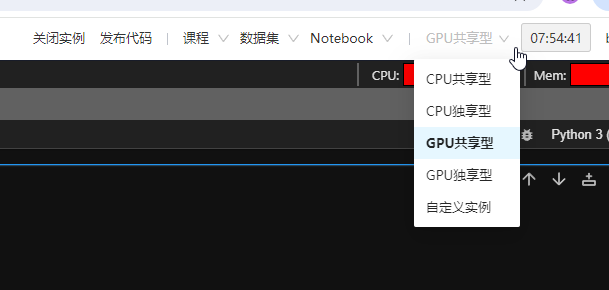

# 迁移学习

## 前言

在深度神经网络算法的应用过程中，如果我们面对的是数据规模较大的问题，那么在搭建好深度神经网络模型后，我们势必要花费大量的算力和时间去训练模型和优化参数，最后耗费了这么多资源得到的模型只能解决这一个问题，性价比非常低。

如果我们用这么多资源训练的模型能够解决同一类问题，那么模型的性价比会提高很多，这就促使使用迁移模型解决同一类问题的方法出现。因为该方法的出现，我们通过对一个训练好的模型进行细微调整，就能将其应用到相似的问题中，最后还能取得很好的效果；另外，对于原始数据较少的问题，我们也能够通过采用迁移模型进行有效解决，所以，如果能够选取合适的迁移学习方法，则会对解决我们所面临的问题有很大的帮助。

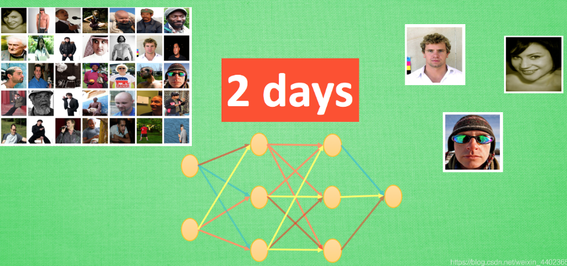

``比如上述图片描述的一个神经网络, 我花了两天训练完之后, 它已经能正确区分图片中具体描述的是男人, 女人还是眼镜. 说明这个神经网络已经具备对图片信息一定的理解能力. 这些理解能力就以参数的形式存放在每一个神经节点中. 不巧, 领导下达了一个紧急任务,要求今天之内训练出来一个预测图片里实物价值的模型. 我想这可完蛋了, 上一个图片模型都要花两天, 如果要再搭个模型重新训练, 今天肯定出不来呀.``


``这时, 迁移学习来拯救我了. 因为这个训练好的模型中已经有了一些对图片的理解能力, 而模型最后输出层的作用是分类之前的图片, 对于现在计算实物价值的任务是用不到的, 所以我将最后一层替换掉, 变为服务于现在这个任务的输出层. 接着只训练新加的输出层, 让理解力保持始终不变. 前面的神经层庞大的参数不用再训练, 节省了我很多时间, 我也在一天时间内, 将这个任务顺利完成。``

## 迁移学习介绍

你会发现聪明人都喜欢”偷懒”, 因为这样的偷懒能帮我们节省大量的时间, 提高效率. 还有一种偷懒是 “站在巨人的肩膀上”。不仅能看得更远, 还能看到更多。这也用来表达我们要善于学习先辈的经验, 一个人的成功往往还取决于先辈们累积的知识。这句话, 放在机器学习中, 这就是今天要说的迁移学习了。

迁移学习（Transfer Learning）是一种机器学习方法，它利用一个已经训练好的模型来解决新的问题。在深度学习中，迁移学习通常指的是将一个预训练的神经网络模型应用于新的任务或数据集上，以减少训练时间和提高模型性能。或者说迁移学习就是把一个领域（即源领域）的知识，迁移到另外一个领域（即目标领域），使得目标领域能够取得更好的学习效果。

**形象化理解迁移学习**

想象你在高中时学了很多数学知识，比如代数、几何和微积分。这些知识在你进入大学学习工程、物理或经济学时非常有用。即使你的专业领域不同，你仍然可以利用这些基础知识来帮助你更快地理解和掌握新的概念。这就是迁移学习的精髓：利用已有的知识来解决新问题。

这就好比，Google 和百度的关系， facebook 和人人的关系, KFC 和 麦当劳的关系, 同一类型的事业, 不用自己完全从头做, 借鉴对方的经验, 往往能节省很多时间. 有这样的思路, 我们也能偷偷懒, 不用花时间重新训练一个无比庞大的神经网络, 借鉴借鉴一个已经训练好的神经网络就行。


在深度学习中，我们可以把这个过程类比为使用一个已经在大规模数据集上训练好的神经网络模型，并将其应用到一个新的、相关的任务上。这样，我们不需要从头开始训练一个全新的模型，而是利用已有模型的“知识”来加速新任务的学习过程。

**为什么现在需要迁移学习？**

前百度首席科学家、斯坦福的教授吴恩达（Andrew Ng）在曾经说过：「迁移学习将会是继监督学习之后的下一个机器学习商业成功的驱动力」。 

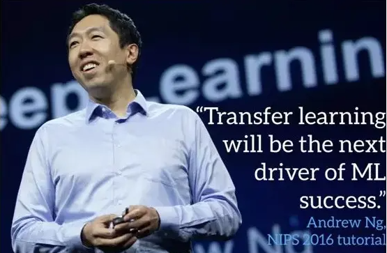

吴恩达在一次采访中，也提到迁移学习会是一个很有活力的领域，我们之所以对迁移学习感到兴奋，其原因在于现代深度学习的巨大价值是针对我们拥有海量数据的问题。但是，也有很多问题领域，我们没有足够数据。比如语音识别。在一些语言中，比如普通话，我们有很多数据，但是那些只有少数人说的语言，我们的数据就不够庞大。所以，为了针对数据量不那么多的中国少数人所说的方言进行语音识别，能将从学习普通话中得到的东西进行迁移吗？我们的技术确实可以做到这一点，我们也正在做，但是，这一领域的进步能让人工智能有能力解决广泛得多的问题。

**迁移学习的作用和应用场景**

1. **数据稀缺**：当目标数据集较小且难以收集大量标注数据时，迁移学习可以帮助利用已有的大型数据集上的预训练模型，从而减少对大量标注数据的依赖。
2. **加快训练速度**：使用预训练模型可以大大减少在新任务上的训练时间，因为大部分权重已经被优化过了，只需对特定层的权重进行微调即可。
3. **提高模型性能**：预训练模型通常在大型数据集上经过长时间训练，具有较好的特征提取能力。通过迁移学习，可以在新任务上获得更好的性能。
4. **跨领域应用**：迁移学习不仅限于计算机视觉领域，还可以应用于自然语言处理、语音识别等多个领域。
5. **微调与冻结**：在迁移学习中，常见的做法是冻结预训练模型的部分层（通常是前面的几层），只对后面的层进行微调。这样可以保持模型的基本特征提取能力，同时适应新的任务。

## 迁移学习理解

迁移学习允许我们将一个预训练模型应用于新的任务。通过**微调（Fine-Tuning）**预训练模型，我们可以利用已经学习到的特征表示，使模型更好地适应特定任务。

假设现在有两个任务一个是TASK A，一个是TASK B。其中TASK B是我们的目标任务，进行猫狗分类。TASK A是其他学者做出来的网络模型（预训练模型）。

``TASK A可能是个非常大的任务，它对数据、计算资源和时间的要求都非常高，但好处是，这些是别人已经训练好的任务。``

``TASK B是我们的目标任务，这个任务没有那么大，因为它的样本量只有几百张图像，没有到上千万这样的级别。样本量小带来的好处是计算量小，但坏处是如果需要训练一个更加复杂模型时，样本量就不够了。``

这时候，一个想法是能否把TASK A训练好的模型结构和权重直接应用到TASK B上，这就有点像果树嫁接。答案当然是可以的，但是需要注意以下两个问题：

（1）输入问题。输入相对来说比较简单，无论哪个TASK，它的输入都是图像，我们只要保证两个任务中输入图像的像素相同即可。

（2）输出问题。输出这是关键！TASK A的输出可能是为了区分1000个类别，但是我们的TASK B简单很多，只分为两类。

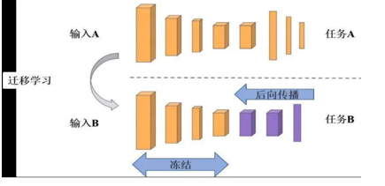

那么如何解决输出问题呢？

- 最简单的办法就是把TASK A整个模型中最后面的那几层输出（通常是全连接层），替换成TASK B想要的形式，例如，猫狗分类，只需要最终输出两个节点。
- 我们要清楚，一般在图像分类的问题当中，卷积神经网络最前面的层用于识别图像最基本的特征，比如物体的轮廓，颜色，纹理等等，而后面的层才是提取图像抽象特征的关键，因此我们只需要使用TASK A前面的网络层级，对后面的全连接层进行重新训练即可（模型微调）。

## 迁移学习的几种方式

1. 冻结预训练模型的全部输入层和隐层，只训练自己定制的全连接层（输出层）。

2. 冻结预训练模型的部分网络层，训练剩下的网络层和全连接层。

3. 获取预训练模型的参数值作为新模型参数的初始化的值，然后抛开预训练模型，只训练自己定制的网络模型，以此增加新模型的收敛速度。

### 预训练模型

torchvision.models：这个包中包含alexnet、densenet、inception、resnet、squeezenet、vgg等常用的网络结构，并且提供了预训练模型，可以通过简单调用来读取网络结构和预训练模型。

```python
import torchvision.models as models

resnet18 = models.resnet18(pretrained=True,progress=True)
vgg16 = models.vgg16(pretrained=True,progress=True)
alexnet = models.alexnet(pretrained=True,progress=True)
squeezenet = models.squeezenet1_0(pretrained=True,progress=True)

# Check if GPU is available  
device = torch.device("cuda" if torch.cuda.is_available() else "cpu")  
model = alexnet.to(device)
```

**参数介绍：**

- pretrained (bool)：True表示返回在 ImageNet 数据集上预训练的模型（训练好的），False表示只返回模型的网络架构（没有训练好）
- progress (bool) 如果为 True，则显示下载到 stderr 的进度条


下载的模型可以通过**state_dict() **来获取模型参数、缓存的字典，如下所示：

```python
import torchvision.models as models
vgg16 = models.vgg16(pretrained=True)
# 返回包含模块所有状态的字典，包括参数和缓存
pretrained_dict = vgg16.state_dict()
```

如果只需要网络结构，不加载参数来初始化，可以将pretrained = False

```python
model = torchvision.models.densenet169(pretrained=False)
# 等价于：
model = torchvision.models.densenet169()
```

**应用VGG16模型，并进行改动，以适应CIDIAR10数据集**。

- CIFAR10数据集是 10个类别
- VGG16输出是1000个类别
- VGG 加一层输出10个类别

**1.导入模型**，输出查看网络结构：

```python
import torchvision
# 直接调用，实例化模型，pretrained代表是否下载预先训练好的参数
vgg16_false = torchvision.models.vgg16(pretrained = False)
vgg16_ture = torchvision.models.vgg16(pretrained = True)
print(vgg16_ture)
```

输出结果，可以看到VGG16的结构，可以看出，**其最后一行 out_features = 1000**.

**2.模型的修改**

- 修改方式1：如在classifier 新增一层全连接层, 使用 **add.module()**

  ```python
  vgg16_ture.classifier.add_module("add_linear",torch.nn.Linear(1000,10)) # 在vgg16的classfier里加一层
  print(vgg16_ture)
  ```

  输出之后，在classifier里，可以看到，最后一行：out_features = 10

- 修改方式2：直接修改对应层，编码相对应

  ```python
  print(vgg16_false)
  vgg16_false.classifier[6] = nn.Linear(4096,10) # 修改对应层,编号相对应
  print(vgg16_false)
  ```

  修改之前与修改之后对比，可以看到classifier中第6行的变化


### 网络层冻结

#### 概述

当我们想要对一个预训练模型进行**微调(fine-tuning)，**或者仅仅只想训练模型中的某些特定层时，就需要用到“冻结”这个概念了。冻结部分参数的意思是在模型训练过程中保持这些参数不变，这在迁移学习中非常常见。

#### 什么是冻结？

冻结是指在模型训练过程中，阻止模型的一部分参数进行更新。在深度学习中，我们经常使用预训练模型作为初始权重，然后仅对特定层进行微调。

**冻结整个模型**

如果你希望冻结整个模型，你可以这样操作：

```python
import torch.nn as nn
from torchvision import models

model = models.resnet18(pretrained=True)
for param in model.parameters(): #返回模型所有网络层的权重系数
    param.requires_grad = False
#上面的代码将会冻结整个ResNet18模型的所有参数。此时如果继续训练模型，所有参数都不会更新。
```

**冻结模型的特定部分**

如果你只需要冻结模型的某些部分网络层，可以按照下面的方式来做：

```python
# 假设model是一个ResNet18模型
for name, param in model.named_parameters():#返回网络层名字和其对应的权重系数
    if 'layer4' not in name: # 只冻结除了layer4之外的所有层
        param.requires_grad = False
        
```

#### 解冻

解冻就是将之前冻结的参数重新变为可训练状态，这可以通过将requires_grad属性设置为True来完成。

```python
for name, param in model.named_parameters():
    if 'layer4' in name: # 只解冻layer4
        param.requires_grad = True
```
